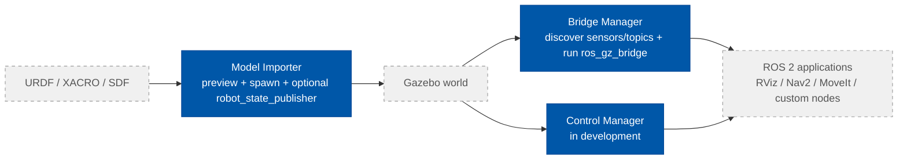
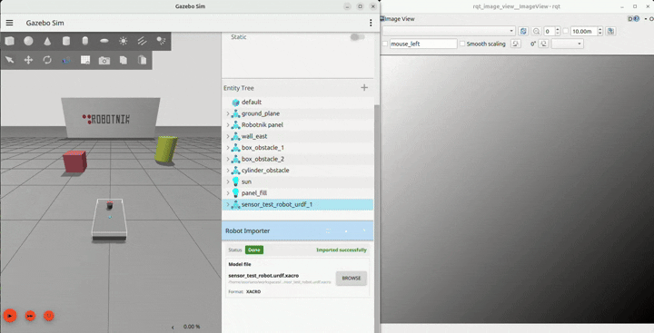

# gz_ros2_bridge_manager

Gazebo Harmonic GUI plugin for ROS 2 Jazzy that discovers active Gazebo sensor topics and launches `ros_gz_bridge` directly from the Gazebo UI.

## Gazebo ROS 2 Model Runtime Suite

This package is part of the **Gazebo ROS 2 Model Runtime Suite**:

1. **[Model Importer](https://github.com/asoriano1/gz_model_importer_plugin)** (`gz_model_importer_plugin`)
   Imports a model into Gazebo, supports preview, final spawn, and optional `robot_state_publisher` for URDF / XACRO.
2. **[Bridge Manager](https://github.com/asoriano1/gz_ros2_bridge_manager)** (`gz_ros2_bridge_manager`)
   Discovers active Gazebo sensor topics and launches the required ROS 2 bridges.
3. **[Control Manager](https://github.com/asoriano1/gz_ros2_control_manager)** (`gz_ros2_control_manager`, in development)
   Discovers `controller_manager` instances, hardware interfaces, and controllers, and provides a UI to load, configure, and activate existing controllers.

This repository provides the **Bridge Manager** step.



## What It Does

- Discovers the running Gazebo world, models, and sensor topics
- Groups bridgeable topics by model
- Builds the required `ros_gz_bridge parameter_bridge` command
- Lets the user run, stop, and restart the managed bridge from Gazebo
- Fits naturally after a model has been imported with `gz_model_importer_plugin`

## Demo



## Requirements

- Ubuntu 24.04
- ROS 2 Jazzy
- Gazebo Harmonic (`gz-sim8`, `gz-gui8`)
- `ros_gz_bridge`

## Build

```bash
cd <workspace>
source /opt/ros/jazzy/setup.bash
colcon build --symlink-install --packages-select gz_ros2_bridge_manager
source install/setup.bash
```

## Start Gazebo With The Plugin

Use the packaged demo world:

```bash
gz sim \
  $(ros2 pkg prefix gz_ros2_bridge_manager)/share/gz_ros2_bridge_manager/worlds/bridge_manager_demo.sdf \
  --gui-config $(ros2 pkg prefix gz_ros2_bridge_manager)/share/gz_ros2_bridge_manager/config/ros2_bridge_manager.config
```

Or load the plugin in your own world:

```bash
gz sim <your_world.sdf> \
  --gui-config $(ros2 pkg prefix gz_ros2_bridge_manager)/share/gz_ros2_bridge_manager/config/ros2_bridge_manager.config
```

## Typical Workflow

1. Start Gazebo with a robot already present in the world.
2. If needed, import the robot first with `gz_model_importer_plugin`.
3. Open the Bridge Manager panel and click **Refresh**, or enable **Auto**.
4. Review the topics discovered under each model.
5. Select the bridges you want to run.
6. Click **Run** to start `ros_gz_bridge`.
7. Use RViz, Nav2, MoveIt, or custom ROS 2 nodes against the bridged topics.

## Notes

- The plugin works from the running Gazebo world. It does not require parsing URDF, XACRO, or SDF source files.
- The plugin manages only the bridge process that it starts itself.

## Author

Ángel Soriano — [Robotnik Automation S.L.L.](https://robotnik.es)
